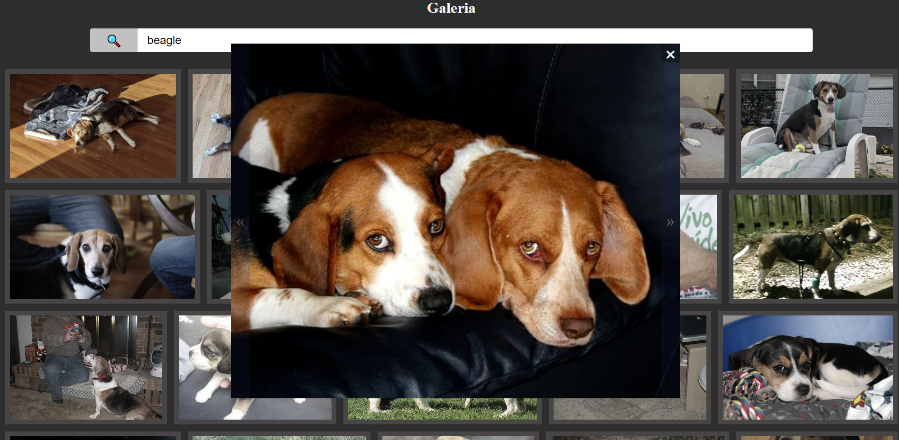

# interactive-semaphore-js

Site created with the didactic purpose for the PWFE classes of the Systems Development course at [SENAI Jandira](https://jandira.sp.senai.br/), about the guidance of professor [Fernando Leonid](https://github.com/fernandoleonid)

The project consists of displaying a gallery of images brought from the "Dog Ceo" API.

The code was built with best practices in mind, such as single responsibility, and pure roles.

